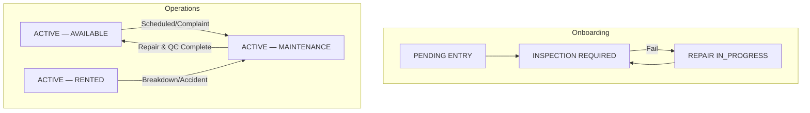

# Workshop Module & Vehicle Onboarding Documentation

This document provides a comprehensive overview of the **Workshop Module** and the specific workflow for **Vehicle to Workshop Onboarding** within the OlaCars Fleet Management system.

---

## 1. Workshop Module Overview

The Workshop module manages the lifecycle of vehicle repairs, maintenance, and inspections. It is centered around the `WorkOrder` entity and is primarily operated by `WORKSHOPSTAFF`.

### Key Entities
- **WorkOrder**: The core document tracking a maintenance event.
- **WorkshopStaff**: Specialized roles (technicians) assigned to tasks.
- **Vehicle**: The asset undergoing service.
- **Branch**: The physical location where the workshop is situated.

### Work Order Lifecycle (State Machine)
The workflow follows a strict transition path to ensure financial and operational accountability:

1.  **DRAFT**: Initial creation by staff.
2.  **PENDING_APPROVAL**: Awaiting cost approval based on estimates.
3.  **APPROVED**: Costing verified; work can proceed.
4.  **VEHICLE_CHECKED_IN**: Odometer captured; physical custody taken.
5.  **IN_PROGRESS**: Active repairs/tasks.
    - *Optional*: **PAUSED** (awaiting info) or **PARTS_REQUESTED**.
6.  **QUALITY_CHECK (QC)**: Verification of completed work.
7.  **READY_FOR_RELEASE**: Passed QC; documentation complete.
8.  **VEHICLE_RELEASED**: Final odometer captured; vehicle returned to fleet.

---

## 2. Vehicle to Workshop Lifecycle Progress

Workshop interaction occurs in two primary scenarios: **Initial Onboarding** and **Operational Maintenance**.

### A. Initial Onboarding (Pre-Entry)
The workshop handles vehicles that fail their entry inspection.
- **Trigger**: `INSPECTION FAILED` status during onboarding.
- **Work Order Type**: `PRE_ENTRY`.
- **Goal**: Resolve "Poor" rated mandatory items to move back to `INSPECTION REQUIRED`.

### B. Operational Maintenance & Complaints
For vehicles already active in the fleet, the workshop handles ongoing service needs.
- **Triggers**:
    - **Preventive**: Scheduled maintenance based on time or mileage (e.g., Oil change).
    - **Corrective (Complaints)**: Triggered by driver/customer reports or staff observations.
    - **Accident/Incident**: Triggered by collision or damage reports.
- **Status Change**: Vehicle moves from `ACTIVE — AVAILABLE` or `ACTIVE — RENTED` to `ACTIVE — MAINTENANCE`.
- **Work Order Types**: `PREVENTIVE`, `CORRECTIVE`, `ACCIDENT`, `WEAR_ITEM`.

### Flow Diagram: Vehicle Workshop Lifecycle

### Stage Detail: Workshop Involvement

| Stage | Trigger | Workshop Responsibility | Status Change |
|-------|---------|-------------------------|---------------|
| **Inspection Failure** | Onboarding inspection fail. | Execute `PRE_ENTRY` repairs. | `REPAIR IN PROGRESS` |
| **Service/Complaint** | Active life maintenance. | Execute `CORRECTIVE` or `PREVENTIVE` work. | `ACTIVE — MAINTENANCE` |
| **Accident Repair** | Collision/Damage report. | Execute `ACCIDENT` repairs; link to Insurance Claim. | `ACTIVE — MAINTENANCE` |
| **Quality Check** | Task completion. | Final verification and photo documentation. | `QUALITY_CHECK` |

### Progress Milestones
As a vehicle moves through the workshop, "Progress" is tracked via:
- **Work Order Status**: Current state of the active Work Order (e.g., `PARTS_REQUESTED`, `IN_PROGRESS`).
- **Labour & Parts**: Cumulative costs and technician time logged.
- **QC Results**: Verification that all faults/complaints have been resolved.

---

## 3. Roles & Permissions

- **WORKSHOPSTAFF**: Can initiate work orders, log labour (Clock In/Out), update tasks, and upload photos.
- **BRANCHMANAGER**: Approves Work Orders (up to $1,000), approves vehicle release, and assigns staff.
- **OPERATIONSTAFF**: Often performs initial inspections and monitors general onboarding progress.

---

## 4. Key Documentation Links
- [Workshop Backend System Design](file:///c:/Users/leno2/Desktop/OlaCarsBackend/docs/workshop_backend_system_design.md)
- [Vehicle API Reference](file:///c:/Users/leno2/Desktop/OlaCarsBackend/docs/VEHICLE_API_REFERENCE.md)
- [Onboarding Workflow](file:///c:/Users/leno2/Desktop/OlaCarsBackend/docs/ONBOARDING_WORKFLOW.md)
